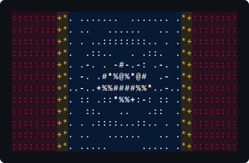

<table>
  <tr>
    <td width="60%" valign="top">
      
<b>Made in Mississippi</b>

      
Dad, husband, veteran, and engineer. Two decades building across the
      stack...from bare-metal to distributed systems.

      
Gaming, defense, education, startups, tribal, state & federal
      government...I'm the guy you call when your systems won't communicate or your
      legacy systems need updated.

    </td>
    <td width="40%" valign="middle">
      
    </td>
  </tr>
</table>

---

<table>
  <tr valign="top">
    <td width="33%">
      
<b>Bare-metal to TypeScript</b>

      

        Database schemas to REST endpoints to WCAG compliant UI components,
        owned end-to-end. No handoffs, no silos, no "that's not my job".
      

    </td>
    <td width="33%">
      
<b>Speaking of legacy...</b>

      

        Oracle, IBM i-Series, Windows Forms...if it's old, undocumented, and
        keeps the lights on, I've probably worked on it. Let's come up with a plan
        and modernize together.
      

    </td>
    <td width="33%">
      
<b>Modern stack, no religion</b>

      

        Do I have opinions? Obviously. But whether it's v-sphere, k8s, Vue/Nuxt, React/Next,
        Tauri, Fastify, Flutter...whatever. Find the problem, fix the problem, containerized,
        typed, and shipped.
      

    </td>

  </tr>
</table>

---

### Projects & Customers

<b>Whatever your project...I've seen worse, weirder, and more complicated. Let's talk.</b>

&nbsp;&nbsp;
&nbsp;&nbsp;
&nbsp;&nbsp;
&nbsp;&nbsp;
&nbsp;&nbsp;
&nbsp;&nbsp;
&nbsp;&nbsp;
&nbsp;&nbsp;
&nbsp;&nbsp;
&nbsp;&nbsp;
&nbsp;&nbsp;
&nbsp;&nbsp;
&nbsp;&nbsp;
&nbsp;&nbsp;
&nbsp;&nbsp;
&nbsp;&nbsp;
&nbsp;&nbsp;
&nbsp;&nbsp;
&nbsp;&nbsp;

---

### I've shipped...

Code:

&nbsp;&nbsp;
&nbsp;&nbsp;
&nbsp;&nbsp;
&nbsp;&nbsp;
&nbsp;&nbsp;
&nbsp;&nbsp;
&nbsp;&nbsp;
&nbsp;&nbsp;
&nbsp;&nbsp;

Client:

&nbsp;&nbsp;
&nbsp;&nbsp;
&nbsp;&nbsp;
&nbsp;&nbsp;
&nbsp;&nbsp;

UI:

&nbsp;&nbsp;
&nbsp;&nbsp;
&nbsp;&nbsp;
&nbsp;&nbsp;
&nbsp;&nbsp;
&nbsp;&nbsp;
&nbsp;&nbsp;
&nbsp;&nbsp;

Server:

&nbsp;&nbsp;
&nbsp;&nbsp;
&nbsp;&nbsp;

Data:

&nbsp;&nbsp;
&nbsp;&nbsp;

Platform:

&nbsp;&nbsp;
&nbsp;&nbsp;
&nbsp;&nbsp;
&nbsp;&nbsp;
&nbsp;&nbsp;
&nbsp;&nbsp;
&nbsp;&nbsp;

